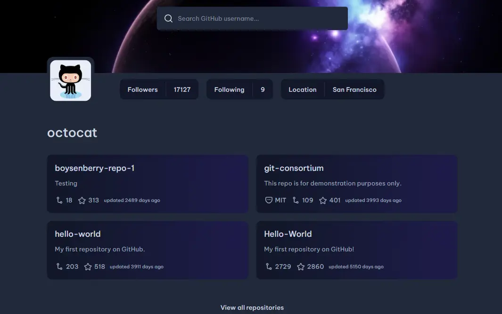

# GitHub Profile App

<div align="center">
  
  <p>Una aplicación moderna para explorar perfiles de GitHub</p>
</div>

## Descripción
GitHub Profile App es una aplicación web que permite buscar y visualizar información detallada sobre cualquier usuario de GitHub. Con una interfaz intuitiva y moderna, muestra datos como biografía, repositorios públicos, estadísticas de seguidores y contribuciones del perfil consultado.

## Características
- 🔍 Búsqueda de perfiles de GitHub en tiempo real
- 👥 Sugerencias de perfiles potenciales mientras escribes
- 📂 Visualización de repositorios públicos con detalles
- 📊 Estadísticas generales del usuario (seguidores, siguiendo)
- 🔗 Enlaces directos a perfiles y repositorios de GitHub
- 🎨 Interfaz amigable y responsiva
- 🚀 Carga optimizada de datos

## Tecnologías Utilizadas
- ⚛️ **React** - Para la interfaz de usuario
- 📝 **TypeScript** - Para tipado estático y mejor mantenimiento del código
- 💅 **Tailwind CSS** - Para estilos modernos y responsivos
- 🌍 **GitHub API** - Para obtener datos de los perfiles
- 🔄 **Custom Hooks** - Para manejo de estado y lógica de negocio

## Estructura del Proyecto
```
src/
├── assets/           # Imágenes, iconos y recursos estáticos
├── components/       # Componentes de React organizados por funcionalidad
│   ├── layout/       # Componentes estructurales (HeroComponent, ContentComponent)
│   ├── profile/      # Componentes relacionados con el perfil de usuario
│   ├── repository/   # Componentes para mostrar repositorios
│   ├── search/       # Componentes de búsqueda
│   └── ui/           # Componentes de UI reutilizables
├── config/           # Configuraciones de la aplicación (API_CONFIG)
├── hooks/            # Custom hooks para lógica reutilizable
│   ├── usePotencialProfile.tsx  # Hook para sugerencias de perfiles mientras se escribe
│   ├── useProfile.tsx           # Hook para obtener datos del perfil seleccionado
│   ├── useRepos.tsx             # Hook para obtener repositorios del usuario
│   └── useSearch.tsx            # Hook para gestionar la búsqueda
├── services/         # Servicios para comunicación con APIs
│   └── githubApi.ts  # Funciones para interactuar con la API de GitHub
├── types/            # Definiciones de tipos TypeScript
│   └── types.ts      # Interfaces y tipos para toda la aplicación
└── utils/            # Funciones utilitarias y helpers
    ├── errorHandling.ts  # Manejo de errores de API
    ├── mappers.ts        # Funciones para transformar datos de la API al formato de la aplicación
    └── utils.ts          # Utilidades generales y funciones de ayuda
```

## Instalación y Uso
### 1️⃣ Clonar el repositorio
```bash
git clone https://github.com/Ibrahim-003/Github-Profile-App.git
cd Github-Profile-App
```

### 2️⃣ Instalar dependencias
```bash
npm install
```

### 3️⃣ Configurar variables de entorno
Crea un archivo `.env` en la raíz del proyecto:
```env
VITE_GITHUB_TOKEN=tu_token_personal_de_github
```
> 📝 **Nota**: Puedes obtener un token personal en [GitHub Developer Settings](https://github.com/settings/tokens). Se recomienda usar un token para evitar limitaciones de la API.

### 4️⃣ Ejecutar en desarrollo
```bash
npm run dev
```
La aplicación estará disponible en `http://localhost:5173/`

## Configuración de Variables de Entorno
Para evitar restricciones en la API de GitHub, se recomienda utilizar un token de acceso. Crea un archivo `.env` en la raíz del proyecto y agrega:
```env
VITE_GITHUB_TOKEN=tu_token_aqui
```
Puedes obtener un token en [GitHub Developer Settings](https://github.com/settings/tokens).

## Capturas de Pantalla


## 🧪 Buenas Prácticas Implementadas
- ✅ **Arquitectura modular** - Componentes y lógica organizados por funcionalidad
- ✅ **Custom hooks** - Separación de lógica de negocio y presentación
- ✅ **Mappers** - Transformación de datos de API a formatos optimizados para la UI
- ✅ **Manejo de errores** - Sistema robusto para capturar y mostrar errores
- ✅ **TypeScript** - Tipado estricto para prevenir errores en tiempo de desarrollo
- ✅ **Componentes reutilizables** - Diseño modular para facilitar mantenimiento
- ✅ **Documentación de código** - Comentarios JSDoc en funciones importantes
- ✅ **Optimización de rendimiento** - Uso de useCallback y dependencias optimizadas en hooks

## 🔜 Mejoras Futuras
- 📱 **Modo oscuro** - Implementación de tema claro/oscuro
- 📊 **Gráficos de actividad** - Visualización de contribuciones y actividad
- 🔍 **Búsqueda avanzada** - Filtros adicionales para búsqueda de usuarios
- 📂 **Paginación de repositorios** - Ver más allá de los repositorios iniciales
- 🌐 **Internacionalización** - Soporte para múltiples idiomas
- 🧪 **Tests unitarios** - Implementación de pruebas para garantizar calidad

## 👥 Contribuciones
¡Las contribuciones son bienvenidas! Para contribuir:

1. Haz un fork del repositorio
2. Crea una nueva rama (`git checkout -b feature/amazing-feature`)
3. Realiza tus cambios y haz commit (`git commit -m 'Add some amazing feature'`)
4. Sube los cambios (`git push origin feature/amazing-feature`)
5. Abre un Pull Request

Por favor, asegúrate de seguir las convenciones de código y añadir tests para nuevas características.

## 📄 Licencia
Este proyecto está bajo la licencia MIT. Consulta el archivo `LICENSE` para más detalles.

## 🙏 Agradecimientos
- [GitHub API](https://docs.github.com/en/rest) por proporcionar acceso a los datos
- [devChallenges.io](https://devchallenges.io/) por la inspiración del proyecto
- Todos los contribuidores que han ayudado a mejorar esta aplicación

---

<div align="center">
  <p>Desarrollado con ❤️ por <a href="https://github.com/Ibrahim-003">Ibrahim-003</a></p>
</div>
